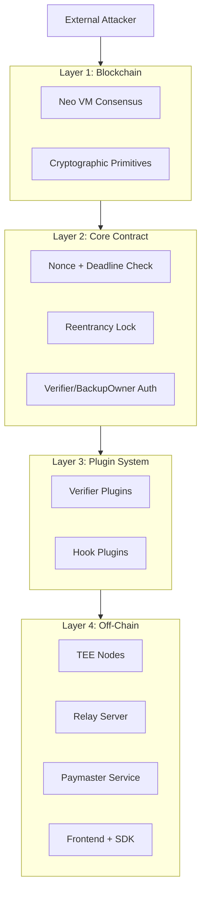
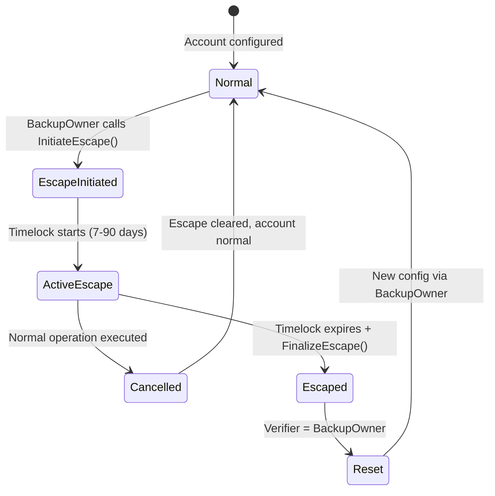

# Neo N3 Abstract Account Security Model

## Executive Summary

The Neo N3 Abstract Account system implements a policy-gated, plugin-based account abstraction architecture. This document defines the threat model, trust assumptions, security properties, and defense-in-depth mechanisms across all layers of the system.

---

## 1. Threat Model

### 1.1 Attackers

| Attacker Type | Capabilities | Primary Attack Vectors |
| --- | --- | --- |
| **External Attacker** | No private keys, can submit transactions | Replay, gas DoS, front-running, signature forgery |
| **Compromised Verifier** | Control of verifier signing key | Unauthorize withdrawals, bypass hooks |
| **Compromised Relay** | Can submit to bundler/relay | Censorship, front-running, selective relay |
| **Compromised TEE Node** | TEE private key access | Unlimited automated transactions |
| **Compromised Paymaster Sponsor** | Sponsor wallet private key | Policy manipulation, deposit withdrawal |
| **Stolen Cold Wallet** | Backup owner private key | Escape hatch takeover |
| **Smart Contract Developer** | Plugin code deployment | Logic bugs, backdoors, malicious hooks/verifiers |

### 1.2 Assets at Risk

| Asset | Protection Mechanism | Threat Level |
| --- | --- | --- |
| **Native Neo Tokens** (NEO, GAS) | Verifier signature + Hook policies + Nonce | High |
| **NEP-17 Tokens** | Verifier signature + Hook policies + Nonce | High |
| **NFTs / SBTs** | Verifier signature + Hook policies + Nonce | Medium |
| **Account Control** (Verifier, Hooks, BackupOwner) | Timelocks, authority checks | Critical |
| **Reputation / Identity** | NeoDID binding + Credential hooks | Medium |

---

## 2. Trust Assumptions

### 2.1 Layer 1: Neo N3 Blockchain

| Assumption | Rationale | Risk if Violated |
| --- | --- | --- |
| **NeoVM is sound** | Code execution is deterministic | Global consensus failure |
| **Cryptography is secure** | secp256k1/r1 are battle-tested | Private key recovery via weaknesses |
| **Network is Byzantine** | < 1/3 honest nodes | Chain reorganizations |

### 2.2 Layer 2: Core Contract

| Assumption | Rationale | Risk if Violated |
| --- | --- | --- |
| **Verifier plugins are honest** | Signature = authorization | Malicious verifier drains funds |
| **Hook plugins don't censor** | Policies only reject, not modify | Hook prevents valid operations |
| **Backup owner is secure** | L1 escape mechanism | Account takeover without recovery |

### 2.3 Layer 3: Plugin Ecosystem

| Assumption | Rationale | Risk if Violated |
| --- | --- | --- |
| **Plugin deployment is authorized** | Only backup owner can install | Unauthorized plugin installation |
| **TEE enclaves are secure** | Hardware-level isolation | TEE key compromise |
| **Relays are semi-honest** | Multiple competing relays | Censorship or front-running |
| **Paymaster is solvent** | On-chain deposit balance or off-chain gas sponsorship | Failed transactions if deposit exhausted |
| **Paymaster policy is honest** | Sponsor controls policy creation | Sponsor can revoke/expire policies at will |

### 2.4 Layer 4: Frontend & SDK

| Assumption | Rationale | Risk if Violated |
| --- | --- | --- |
| **User's device is secure** | Private key storage | Key theft via malware |
| **RPC endpoints are honest** | Transaction submission | Transaction censorship |
| **Supabase is secure** | Draft/collaboration storage | Draft manipulation |

---

## 3. Security Properties by Layer

### 3.1 Core Contract Layer

| Property | Implementation | Threat Mitigated |
| --- | --- | --- |
| **Integrity** | State in `UnifiedSmartWallet` | Contract can't be modified without deployer |
| **Confidentiality** | Public ledger | No private data on-chain |
| **Availability** | No per-account deployment | Single point of failure |
| **Non-repudiation** | Nonce + Deadline | Sender can't deny transaction |
| **Replay Protection** | Nonce + Network ID + Deadline | Can't replay on same/different chain |
| **Operation Shape** | Target/method/argument/serialization/signature/batch bounds | Rejects malformed and resource-amplifying input before execution |

### 3.2 Verification Layer

| Property | Implementation | Threat Mitigated |
| --- | --- | --- |
| **Authentication** | Verifier signature checks | Unauthorized ops rejected |
| **Authorization** | Backup owner / Verifier separation | Privilege escalation prevented |
| **Freshness** | Nonce increment / Salt consumption | Replay rejected |
| **Cross-chain isolation** | `Runtime.GetNetwork()` in payload | Can't replay across networks |

### 3.3 Policy/Hook Layer

| Property | Implementation | Threat Mitigated |
| --- | --- | --- |
| **Transfer limits** | `DailyLimitHook` | Large thefts mitigated |
| **Target allowlisting** | `WhitelistHook` | Fraudulent contract interaction blocked |
| **Token restrictions** | `TokenRestrictedHook` | Unauthorized token transfers blocked |
| **Credential gating** | `NeoDIDCredentialHook` | Unverified users blocked |
| **Composability** | `MultiHook` | Combined policies enforce AND logic |

### 3.4 Recovery Layer

| Property | Implementation | Threat Mitigated |
| --- | --- | --- |
| **L1 fallback** | Backup owner native witness | Verifier failure recovery |
| **Delayed takeover** | Escape timelock (7-90 days) | Immediate takeover prevented |
| **Activity cancellation** | Normal ops cancel escape | Stolen wallet can't quietly takeover |
| **Auditability** | Escape events logged | Recovery attempts visible |

---

## 4. Defense-in-Depth Architecture

### Layer 1: Blockchain Primitives
- **NeoVM:** Deterministic execution, bounded gas
- **Cryptography:** secp256k1 (EVM), secp256r1 (Passkey/TEE), SHA256, Keccak256

### Layer 2: Core Contract
- **Nonce + Deadline:** Replay protection
- **Execution Lock:** Reentrancy prevention (`IsAnyExecutionActive()`)
- **Verify Context:** Limits `CheckWitness(accountId)` to execution context
- **Authority Separation:** Verifier (who) vs Hook (what) vs Core (how)

### Layer 3: Plugin System
- **Verifier Isolation:** Stateless, no direct state access
- **Hook Gating:** Pre/post execution policies
- **Authority Validation:** `CanConfigureVerifier` / `CanExecuteHook` checks
- **Module Lifecycle:** Timelocked updates with events

The core passes hook callbacks a single canonical operation tuple in both phases:
`[TargetContract, Method, Args, Nonce, Deadline, Signature]`; the account id remains a separate
callback argument. This prevents a hook from validating one operation representation and metering
another. A real NeoVM regression vector confirms that `WhitelistHook` accepts the signed target,
rejects an unlisted target before dispatch, and rolls back the nonce on rejection.

### Layer 4: Off-Chain Infrastructure
- **TEE Attestation:** Hardware root of trust (future)
- **Relay Diversity:** Multiple competing relays prevent censorship
- **Paymaster Policy:** Off-chain sponsorship rules
- **Frontend Sanitization:** Input validation, error message stripping

---

## 5. Critical Security Invariants

### 5.1 Must-Hold Invariants

1. **Nonce Monotonicity:** Nonces never decrease within a channel
2. **Deterministic Address:** Same `accountId` always resolves to same address
3. **Replay Prevention:** Same operation cannot execute twice
4. **Context Isolation:** `CheckWitness(accountId)` only valid during `executeUserOp`
5. **Escape Atomicity:** Either completes fully or not at all
6. **Market Escrow Exclusivity:** Escape/initiative changes blocked during escrow

### 5.2 Should-Hold Invariants

1. **Gas Limits on Verifiers:** *(OPEN)* Verifier execution still needs explicit gas/resource accounting.
2. **Plugin State Cleanup:** *(PARTIAL)* Current settlement clears known plugin markers and rejects modules whose manifest omits the V3 lifecycle ABI; semantic cleanup/refinement coverage for arbitrary future plugins is pending.
   Every verifier and hook must implement `clearAccount`: the core calls it without a fallback from
   `confirmVerifierUpdate`, `confirmHookUpdate`, `finalizeEscape` and `settleMarketEscrow`, and a
   nested call to a missing method faults the enclosing transaction uncatchably. The
   `SocialRecoveryVerifier` source now implements it (core-gated, oracle credit refunded to the
   recovery owner, consumed action nullifiers retained as replay protection). The recovery verifier
   artifacts recorded as deployed on TestNet and MainNet predate this method, so an account bound to
   a deployed instance cannot rotate away from it, finalize an escape or be sold until that instance
   is upgraded through its timelocked `proposeUpdate`/`update` path.
3. **Session Key Revocation:** *(DEFINED)* Revocation is effective at canonical transaction execution order; a later validation sees no active key, and `SessionKeyRevoked` is emitted. No protocol component promises mempool cancellation or retroactive invalidation of an operation already executed earlier in the chain.
4. **Transfer-Source Metering:** A virtual account's assets live at the core-derived proxy script
   hash (`getProxyScriptHash(accountId)`), never at the `accountId`. A verifier or hook that pins or
   meters a transfer source must compare against that proxy address; `SubscriptionVerifier` and
   `DailyLimitHook` do so, and a source equal to the `accountId` is rejected outright.
5. **Plugin-Level Witness Checks Need a Reaching Scope:** A verifier or hook runs as a nested call
   from the core, so a `Runtime.CheckWitness` inside it (the merchant check in
   `SubscriptionVerifier`, for example) only sees signers whose scope reaches the plugin.
   `CalledByEntry` stops at the core and is rejected; the private-chain validation records that
   fault and the successful pull with a reaching scope. A merchant scopes its signer to the
   verifier with `CustomContracts` rather than signing `Global`.

---

## 6. Attack Surface Analysis

### 6.1 Known Vulnerabilities

| ID | Severity | Component | Description | Status |
| --- | --- | --- | --- |
| **VULN-001** | Critical | **Verifier Gas DoS** | Current AA artifact still uses unbounded verifier `Contract.Call`; platform budget prototype is not integrated | Open / current artifact exposed; integration pending |
| **VULN-002** | High | **Escape Hatch Bypass** | Market settlement intentionally clears escape; owner cancellation is timelocked | Mitigated in source; refinement/deployment unverified |
| **VULN-003** | Medium | **Session Key Ordering** | A signed operation can execute before a later revocation transaction is ordered | Defined execution-order semantics; residual pre-inclusion operational risk |
| **VULN-004** | Medium | **MultiSig Empty Array** | Empty, oversized, invalid-threshold, duplicate, self-referential and incomplete-child configurations | Bounded Coq policy + 11 real Neo VM vectors + child manifest preflight; key independence, cycles, crypto/VM/refinement boundary remains open |
| **VULN-005** | Medium | **Plugin State Orphaning** | Settlement cleanup is finite and not proven for every plugin | Manifest lifecycle preflight for core, MultiSig and MultiHook plus fail-closed cleanup; arbitrary-plugin storage/refinement coverage remains open |
| **VULN-006** | Low | **Nonce Collision** | Legacy salt wording; current core uses 192-bit channel + 64-bit sequence with uint256 bound | Fixed in protocol core; transport/refinement unverified |

**VULN-001 closure gate:** the current NeoVM `Contract.Call` surface exposes no
per-verifier gas budget or independent gas meter. `Runtime.GasLeft`/`BurnGas`
can provide diagnostics or voluntary accounting, but they do not establish a
non-bypassable cap around an untrusted child call. This item therefore remains
open; it must not be relabeled mitigated by a local pre-check or by total
transaction gas limits. Closure requires a platform-level call-budget
capability, or a redesigned verifier boundary with an independently bounded
execution path, plus exhaustion and rollback vectors.

An isolated Neo core/DevPack platform prototype now implements the required
capability as `System.Contract.CallWithGasLimit`, with an ancestor-inherited
budget and fail-closed exhaustion. The prototype has 7/7 targeted engine
vectors and 1,433/1,433 Neo core unit tests, but the current AA artifact still
uses the published 3.9.1 framework and has not been compiled, activated, or
read back with the new syscall. See
`docs/proposals/AA-VERIFIER-GAS-BUDGET-EXTENSION-20260920.md`. VULN-001
therefore remains open and must not be marked mitigated yet.

**Witness/callback evidence boundary:** the runtime suite now covers bounded proxy-script shape
vectors (wrong account, arbitrary/non-data instructions, decoy/global signer, and fee-payer
cases) and the shipped hook callback tuple, and the transaction-script shape parser itself has a
closed Coq model (`formal/coq/ProxyWitnessScript.v`) proving that an accepted script is data
pushes followed by exactly the expected core call, with the account id and core hash bound.
This is implementation evidence plus a parser-shape proof, not a formal proof of NeoVM witness
condition evaluation, signer scopes, cryptographic primitives, arbitrary plugins, or full
callback refinement.
The core also rejects oversized verifier signatures and argument arrays before nonce
consumption or external dispatch. This is input-amplification mitigation only; it cannot cap a
verifier that is already executing inside the shared NeoVM gas budget.
A read-only RPC comparison of the known canonical TestNet/MainNet AA core hashes also
found different NEF scripts than the current local artifact. This is a detected deployment
drift, not a current-artifact deployment proof; no public write was performed.

### 6.2 Mitigated Attack Vectors

| Attack | Mitigation | Status |
| --- | --- | --- |
| **Signature Replay** | Nonce + Network ID + Deadline | ✓ Mitigated |
| **Reentrancy** | Execution lock + Context isolation | ✓ Mitigated |
| **Cross-Chain Replay** | `Runtime.GetNetwork()` in all payloads | ✓ Mitigated |
| **Front-Running** | Nonce prevents same-op reuse | ✓ Mitigated |
| **Hook Censorship** | Hooks only reject, don't modify | ✓ Mitigated |
| **Verifier Bypass** | Authority checks on all calls | ✓ Mitigated |
| **Market Escrow Censorship** | Backup owner's timelocked `initiateMarketEscrowCancel` / `forceCancelMarketEscrow`; the market `abandonListing` callback is pre-flighted through the market's manifest so a destroyed, upgraded-away, method-less or throwing market cannot block the escape | ✓ Mitigated (see boundary below) |
| **Paymaster Front-Running** | On-chain atomic settlement; off-chain decision pre-submission | ✓ Mitigated (on-chain) / Partially mitigated (off-chain) |
| **Paymaster Deposit Drain** | Per-op limits + daily budgets + total budgets | ✓ Mitigated |
| **RPC Censorship** | Multiple relays + client-side broadcast | ✓ Mitigated |

**Market escrow trust boundary:** entering an escrow delegates settle authority to the market
contract. `settleMarketEscrow` and `cancelMarketEscrow` are authorized purely by
`CallingScriptHash == marketContract`, so a hostile market that the backup owner listed on can
settle the account to any address it chooses; no owner action is required. The owner escape
therefore protects against a market that is destroyed, upgraded without `abandonListing`, never
settles, or throws. It does not protect against a market that aborts inside its own
`abandonListing`, and it cannot: NeoVM `ASSERT`/`ABORT` faults are uncatchable and no
call-site guard exists. Only list accounts on audited markets; the shipped `AAAddressMarket`
allowlists the core it trusts, and the same allowlisting discipline applies in the other direction.

---

## 7. Cryptographic Security

### 7.1 Signature Schemes

| Scheme | Curve | Key Size | Security Level | Use Cases |
| --- | --- | --- | --- |
| **Neo Native** | secp256r1 | 256-bit | Backup owner |
| **EVM/EIP-712** | secp256k1 | 256-bit | Web3Auth |
| **WebAuthn/Passkey** | secp256r1 | 256-bit | Biometrics |
| **TEE** | secp256r1 | 256-bit | Automated agents |
| **Session Key** | secp256r1 | 256-bit | Temporary delegation |

### 7.2 Hash Functions

- **SHA256:** Used for payload hashing in most verifiers
- **Keccak256:** Used for `Web3AuthVerifier` EIP-712 compatibility
- **Nonce Storage:** Storage key includes `accountId` + a uint192 channel; the uint64 sequence is the stored cursor

### 7.3 Replay Protection Mechanisms

1. **Nonce:**
   - Canonical two-dimensional form: `channel = nonce >> 64`, `sequence = nonce & (2^64 - 1)`
   - Core rejects negative and over-width values; each channel advances exactly one step

2. **Deadline:**
   - Absolute timestamp (`Runtime.Time`)
   - Must be in future for execution

3. **Network ID:**
   - `Runtime.GetNetwork()` included in payload hash
   - Prevents cross-chain replay

---

## 8. Operational Security

### 8.1 Relay Server Security

| Mechanism | Purpose |
| --- | --- |
| **Rate Limiting** | Prevent DoS via request flooding (10 req/min) |
| **Request Durability** | Prevent double-submission via deduplication |
| **Input Validation** | Script hash allowlist, raw transaction bounds |
| **Error Sanitization** | Strip sensitive information from error responses |
| **Simulation First** | Validate before broadcasting to save gas |

### 8.2 Paymaster Security

#### On-Chain Paymaster (`AAPaymaster`)

| Mechanism | Purpose |
| --- | --- |
| **Deposit-Backed** | Sponsorship is only possible with pre-deposited GAS |
| **Policy Enforcement** | Per-account or global policies with target/method restrictions |
| **Per-Op Limits** | Each operation capped to `MaxPerOp` GAS |
| **Daily Budget** | Rolling 24-hour spend cap per (sponsor, account) pair |
| **Total Budget** | Lifetime spend cap with overflow protection |
| **Expiry Timestamps** | Policies auto-expire at `ValidUntil` |
| **Core-Only Settlement** | Only the authorized AA core contract can call `settleReimbursement` |
| **Checks-Effects-Interactions** | Deposit deducted before GAS transferred to relay |
| **Atomic Execution** | Settlement reverts if policy check or GAS transfer fails |

#### Off-Chain Paymaster (Morpheus)

| Mechanism | Purpose |
| --- | --- |
| **API Token Auth** | Prevent unauthorized sponsorship |
| **Off-chain Validation** | Apply business rules before chain submission |
| **Network Isolation** | Testnet/Mainnet separation |
| **Reason Disclosure** | Explain rejections to users |

**Reimbursement cap and fee estimation:** `executeSponsoredUserOp` caps the settled
reimbursement at the enclosing transaction's system fee plus network fee. A container whose
fees are both zero can only be an `invokescript`/`invokefunction` estimation (a persisted
transaction must pay for its consumed gas and for witness verification), so that container
caps at the requested amount, the largest amount the chain could settle; every transaction
that reaches a block is capped by its real fees. The cap is computed without a branch so the
estimation and the persisted transaction execute the same instruction sequence, and the
private-chain validation asserts that the estimate equals the persisted gas to the datoshi.
Both were found on a private NeoExpress chain: the original cap faulted the estimation with
"Reimbursement exceeds actual gas cost", and an early-return fix under-estimated the system fee
by the instructions it skipped, so the persisted transaction faulted with "Insufficient GAS".
The settled amount itself still differs between the two containers, which can change the byte
length of a stored balance at a power-of-256 boundary and move the storage fee by one unit, so
a relay should keep the customary system-fee margin on sponsored submissions.

### 8.3 TEE Security

| Mechanism | Purpose |
| --- | --- |
| **Hardware Attestation** | *(Future)* Verify genuine TEE execution |
| **Policy Enforced in TEE** | Complex logic off-chain, signature on-chain |
| **Session Key Issuance** | TEE-bound temporary delegation |

---

## 9. Recovery & Emergency Access

### 9.1 Escape Hatch Flow

### 9.2 Security Properties

| Property | Guarantee |
| --- | --- |
| **Delayed Takeover** | 7-90 day minimum timelock |
| **Cancel-on-Use** | Any valid op cancels escape |
| **Audit Trail** | All escape events emitted |
| **No Bypass** | *(PARTIAL)* Market escrow can clear escape |

---

## 10. Compliance & Privacy

### 10.1 Privacy Properties

| Data | On-Chain | Public |
| --- | --- | --- |
| **Verifier Public Key** | ✓ | ✓ Signature verification required |
| **Hook Policies** | ✓ | ✓ Allowlist/rules visible |
| **Transaction History** | ✓ | ✓ Ledger transparency |
| **User Identity** | ✗ | Off-chain only (DID) |
| **Session Keys** | ✓ (public) | ✓ Temporary delegation visible |

### 10.2 Regulatory Considerations

| Requirement | Support |
| --- | --- |
| **KYC/AML Integration** | Via `NeoDIDCredentialHook` |
| **Sanctions Screening** | Via `WhitelistHook` |
| **Transaction Monitoring** | Via relay server logs |
| **Recovery Standard** | L1 timelock escape hatch |
| **User Sovereignty** | Backup owner control guaranteed |

---

## 11. Future Security Enhancements

### 11.1 Critical Priority

1. **Verifier Gas Limits:** Integrate and activate the platform
   `System.Contract.CallWithGasLimit` extension; do not rely on an ABI gas
   parameter or voluntary verifier accounting.
2. **Deployed Refinement:** Prove/read back that the hardened source and formal boundary match deployed NEF
3. **Session Key Cancellation UX:** Relayers and wallets must re-check canonical key state before submission; cancellation is not a chain-level rollback primitive

### 11.2 Medium Priority

4. **TEE Attestation:** Integrate remote attestation verification
5. ~~**Paymaster Staking:**~~ Resolved — `AAPaymaster` contract provides on-chain deposit-backed sponsorship
6. **Plugin Audit System:** Verified plugin marketplace

### 11.3 Low Priority

7. **Protocol Conformance:** Add canonical vectors for uint256 nonce encoding, UTF-8 method bounds and nested-argument limits
8. **Account-Based Rate Limiting:** Per-account limits in relay
9. **Formal Verification:** Independent review of the remaining refinement and callback boundaries

---

## 12. References

- **ERC-4337:** https://eips.ethereum.org/EIPS/eip-4337
- **ERC-7579:** https://eips.ethereum.org/EIPS/eip-7579
- **Neo Documentation:** https://docs.neo.org/
- **Security Audit:** `docs/SECURITY_AUDIT.md`
- **Plugin Matrix:** `docs/PLUGIN_MATRIX.md`
