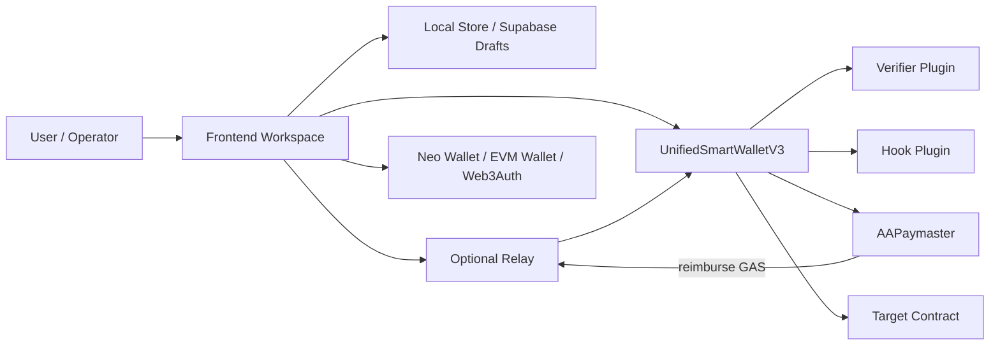
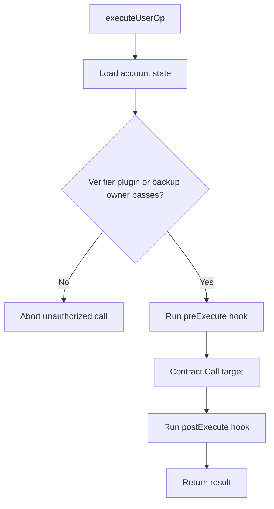
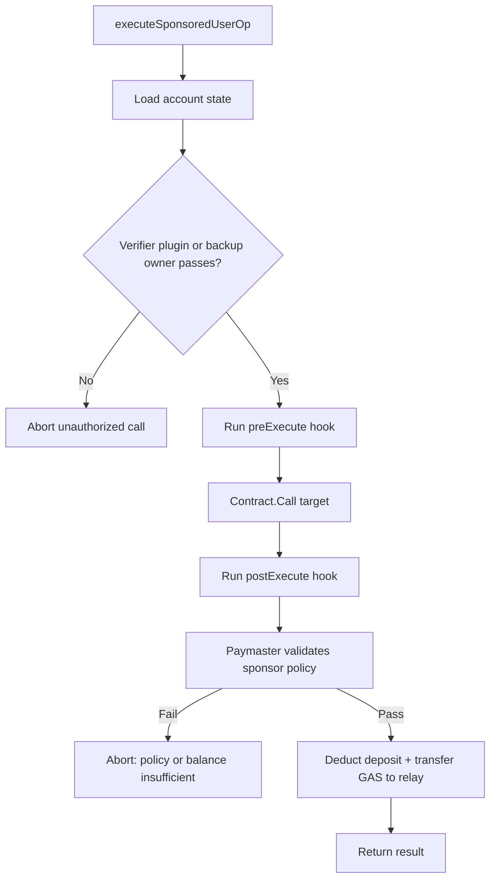

# Core Architecture

This page describes the active `main`-branch architecture for `UnifiedSmartWalletV3`.

## 1. Component Map



The Neo N3 Abstract Account system is a **policy-gated** smart contract wallet architecture. V3 keeps one shared execution engine and moves account-specific auth and policy into plugin bindings instead of embedding large role tables inside the core wallet.

## 2. Account Model

Each account is keyed by a deterministic 20-byte `accountId`.

- The frontend derives `accountId` from a seed, pubkey, or already-hashed 20-byte value.
- The virtual Neo address is derived locally from `verify(accountId)` plus the master contract hash.
- On-chain account state stores:
  - `verifier`
  - `hook`
  - `backupOwner`
  - `escapeTimelock`
  - `escapeTriggeredAt`
  - nonce channels

V3 is therefore **accountId-first**. Reverse discovery from legacy role indexes is no longer part of the active model.

## 3. Verification Pipeline

```mermaid
flowchart TD
  Start[Tx reaches Neo node] --> Verify[Node triggers verify(accountId)]
  Verify --> Context[Core checks transient execution context]
  Context --> Allowed{Target matches active ExecuteUserOp call?}
  Allowed -- No --> Reject1[Reject unexpected witness use]
  Allowed -- Yes --> Execute[ExecuteUserOp(accountId, op)]
  Execute --> Auth{Verifier plugin passes or backup owner witness passes?}
  Auth -- No --> Reject2[Reject unauthorized operation]
  Auth -- Yes --> Nonce[Consume nonce / deadline]
  Nonce --> PreHook[Run preExecute hook if configured]
  PreHook --> Call[Contract.Call(target, method, args)]
  Call --> PostHook[Run postExecute hook if configured]
  PostHook --> Return[Return result]
```

## 4. Application Execution Pipeline



## 5. Sponsored Execution Pipeline

When a sponsor funds gas via the `AAPaymaster` contract, the core wallet uses `executeSponsoredUserOp(accountId, op, paymaster, sponsor, reimbursementAmount)` (or its batch variant) instead of the standard `executeUserOp`.



Sponsors deposit GAS into the Paymaster via NEP-17 transfer and create policies with `setPolicy(accountId, targetContract, method, maxPerOp, dailyBudget, totalBudget, validUntil)`. Use `accountId = UInt160.Zero` for a global policy that sponsors any account. Settlement is atomic: policy check, deposit deduction, and relay reimbursement happen inside a single call. For fee-bearing transactions, reimbursement is `min(requested, SystemFee + NetworkFee)`. `maxPerOp` caps that settlement, not the total fee; the relay bears any unreimbursed portion. Daily and total budgets apply to the resolved policy scope, with global policies sharing one scope across accounts. Zero-fee RPC estimation uses the requested amount as its conservative cap; it does not unconditionally abort.

## 6. Authorization Modes

V3 supports several authorization modes, but they all converge on `executeUserOp(accountId, op)`:

- **Backup-owner native witness** when no verifier plugin is configured.
- **Web3Auth / EIP-712 verifier** for secp256k1 typed-data approvals.
- **TEE / WebAuthn / SessionKey / MultiSig / ZkLogin** verifier plugins. (**ZKEmail** is deployed but intentionally disabled pending real proof verification — it faults on every use today.)
- **Custom hooks** for policy enforcement or post-execution bookkeeping.

This is the critical boundary: verifier plugins decide **who may authorize**, while hook plugins decide **what extra policy runs around execution**.

## 7. Escape Hatch

Every V3 account can define a backup owner and timelock.

1. `initiateEscape(accountId)` starts the backup-owner recovery window.
2. After the timelock elapses, `finalizeEscape(accountId, newVerifier)` rotates the verifier binding.
3. Any successful normal `executeUserOp` clears an in-progress escape flow.

That makes recovery explicit and auditable without reintroducing the old V2 admin/manager graph.

## 8. Frontend and Relay Model

The app workspace is V3-first:

- users load an account from its deterministic seed or `accountId` hash
- the UI stages `executeUserOp`
- EVM signatures are attached as relay-ready invocations
- operators can choose client broadcast or relay submission
- shared drafts keep only the latest 100 activity entries and 12 submission receipts

Legacy `executeUnifiedByAddress` handling remains compatibility-only and should not be presented as the primary runtime path.

## 9. Module Lifecycle

The runtime now exposes a generic module lifecycle in addition to the legacy verifier/hook-specific events.

- **install** — first binding of a verifier or hook emits `ModuleInstalled`
- **replace** — pending rotations emit `ModuleUpdateInitiated` and confirmed rotations emit `ModuleUpdateConfirmed`
- **remove** — clearing a binding, escape-driven clearing, or market-settlement cleanup emits `ModuleRemoved`
- **cancel** — aborting a pending verifier or hook rotation emits `ModuleUpdateCancelled`

For new operational tooling, prefer the generic module lifecycle instead of stitching together verifier-only and hook-only event streams.

## 10. Validation Preview

Relay preflight now has two layers:

- a **validation preview** from the core runtime via `previewUserOpValidation(accountId, op)` that checks deadline validity, nonce acceptability, and current verifier/hook bindings
- full relay simulation that executes the relay-ready invocation against Neo RPC and returns VM state and gas estimates

The validation preview is intentionally read-only and does not authorize or execute anything by itself.

The relay trust boundary is explicit:

- the relay can simulate and submit
- the relay cannot authorize for the account
- paymaster sponsorship does not authorize execution

## 11. Contract File Map

| File | Responsibility |
| --- | --- |
| `contracts/UnifiedSmartWallet.cs` | V3 core account state, nonce handling, `verify`, `executeUserOp`, hook/verifier config, backup-owner escape |
| `contracts/verifiers/Web3AuthVerifier.cs` | EIP-712 `UserOperation` verification for secp256k1/Web3Auth flows |
| `contracts/verifiers/TEEVerifier.cs` | TEE-signed authorization |
| `contracts/verifiers/WebAuthnVerifier.cs` | Passkey / WebAuthn authorization |
| `contracts/verifiers/SessionKeyVerifier.cs` | Short-lived delegated execution keys |
| `contracts/verifiers/ZkLoginVerifier.cs` | Morpheus NeoDID / Web2 identity-root authorization with operation-bound zklogin tickets |
| `contracts/verifiers/MultiSigVerifier.cs` | Plugin-based multisig authorization |
| `contracts/hooks/*.cs` | Optional execution policies such as daily limits, token restrictions, credential gating, and hook composition |
| `contracts/paymaster/Paymaster.cs` | `AAPaymaster`: on-chain GAS deposit pool and policy engine for sponsored/gasless transactions |

## 12. Security Invariants

1. `verify(accountId)` only succeeds during a matching `executeUserOp` context.
2. Nonces are consumed in the core wallet, not in the verifier plugins.
3. Verifier plugins do not automatically grant policy bypass; hooks and target contracts still run.
4. Backup-owner recovery is timelocked and explicit.
5. The user-facing V3 path is deterministic `accountId -> virtual address -> executeUserOp`.
6. Relay preflight and paymaster sponsorship are operator conveniences only; they do not replace verifier authorization.
