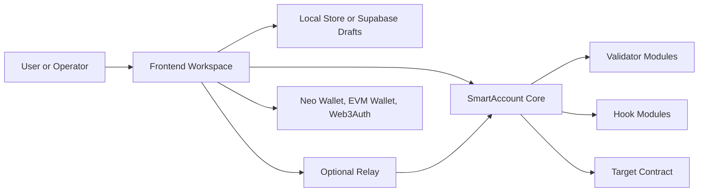
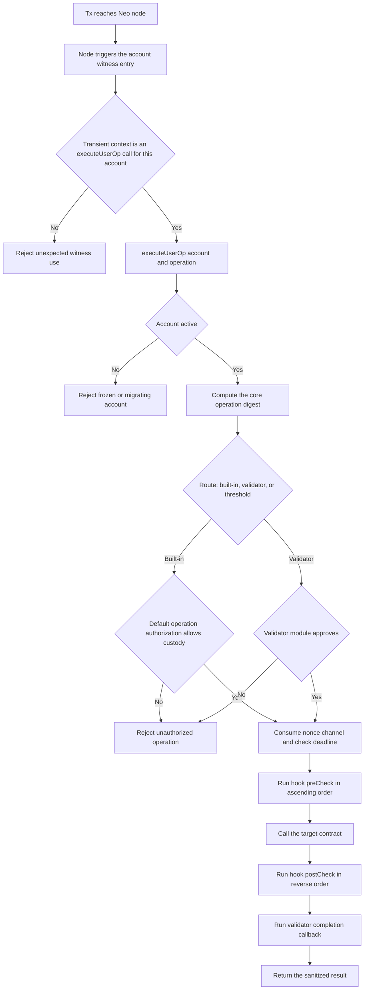
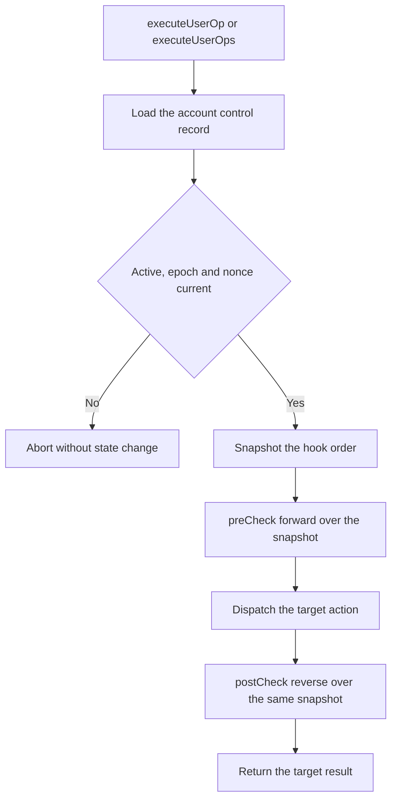

# Core Architecture

This page describes the active architecture of protocol version 4: one SmartAccount core, implemented by
the native kernel (`contracts/native/SmartAccount/`), and modules that plug into a fixed lifecycle.

## 1. Component Map


```mermaid
flowchart LR
  User[User or Operator]
  Browser[Frontend Workspace]
  Drafts[Local Store or Supabase Drafts]
  Relay[Optional Relay]
  Wallets[Neo Wallet, EVM Wallet, Web3Auth]
  Core[SmartAccount Core]
  ValidatorModule[Validator Modules]
  HookModule[Hook Modules]
  Target[Target Contract]

  User --> Browser
  Browser --> Wallets
  Browser --> Drafts
  Browser --> Relay
  Browser --> Core
  Relay --> Core
  Core --> ValidatorModule
  Core --> HookModule
  Core --> Target
```

The system is a **policy-gated** smart contract wallet architecture. The core keeps one execution
engine; account-specific authorization and policy live in module instances rather than in role tables
inside the wallet.

## 2. Account Model

An account is keyed by a deterministic 20-byte account id:

```
accountId = hash160(0xAA524704 || custody || salt)
```

The custody script hash and the salt are the only identity inputs, so changing either changes the
account. The asset-holding address is the proxy script that embeds the account id and the core hash;
the id itself never holds assets.

`getAccount` returns one control record:

```
[exists, status, custody, recoveryAuthority, authorityEpoch, configurationNonce,
 recoveryTimelockMs, defaultOperationAuthorization, defaultMessageAuthorization,
 ownerOnlyRecovery, hookOrderRevision, controlRevision, recoveryPending,
 recoveryMatureAt, marketEscrowActive, legacyRow]
```

- `status` is 0 active, 1 frozen, 2 migration required.
- `marketEscrowActive` and `legacyRow` are fixed ABI slots that the native kernel answers `false`;
they are read for shape compatibility, never interpreted.
- `authorityEpoch` increments on freeze, recovery and settlement: every signature and intent signed
  against the previous epoch dies with it.
- `configurationNonce` increments whenever the configuration changes, so a pending intent probes the
  configuration it was proposed against.
- `hookOrderRevision` and `controlRevision` let a reader reject a stale snapshot of the hook set or of
  the control subject.
- `defaultOperationAuthorization` and `defaultMessageAuthorization` gate the built-in route; a custody
  signature is routed by them, and a validator module is not needed for the account to have an owner.

The core is accountId-first. Reverse discovery from role indexes is not part of the model.

## 3. Verification Pipeline


```mermaid
flowchart TD
  Start[Tx reaches Neo node] --> Witness[Node triggers the account witness entry]
  Witness --> Context{Transient context is an executeUserOp call for this account}
  Context -- No --> Reject1[Reject unexpected witness use]
  Context -- Yes --> Execute[executeUserOp account and operation]
  Execute --> Status{Account active}
  Status -- No --> Reject2[Reject frozen or migrating account]
  Status -- Yes --> Digest[Compute the core operation digest]
  Digest --> Route{Route: built-in, validator, or threshold}
  Route -- Built-in --> Default{Default operation authorization allows custody}
  Default -- No --> Reject3[Reject unauthorized operation]
  Default -- Yes --> Nonce[Consume nonce channel and check deadline]
  Route -- Validator --> Validate{Validator module approves}
  Validate -- No --> Reject3
  Validate -- Yes --> Nonce
  Nonce --> PreHook[Run hook preCheck in ascending order]
  PreHook --> Call[Call the target contract]
  Call --> PostHook[Run hook postCheck in reverse order]
  PostHook --> Complete[Run validator completion callback]
  Complete --> Return[Return the sanitized result]
```

The witness entry that the proxy script embeds is a real gate, not a legacy alias: it only succeeds
while the same transaction is executing an operation for that account.

## 4. Application Execution Pipeline


```mermaid
flowchart TD
  Entry[executeUserOp or executeUserOps] --> Load[Load the account control record]
  Load --> Sane{Active, epoch and nonce current}
  Sane -- No --> Reject[Abort without state change]
  Sane -- Yes --> Hooks[Snapshot the hook order]
  Hooks --> Pre[preCheck forward over the snapshot]
  Pre --> Dispatch[Dispatch the target action]
  Dispatch --> Post[postCheck reverse over the same snapshot]
  Post --> Return[Return the target result]
```

A batch is one envelope with at most 32 operations, and it either commits wholly or aborts. The hook
order snapshot is bound into the signature, so a signer cannot be shown a different hook set than the
one that runs.

## 5. Authorization Modes

Every route converges on the same entrypoint, and the route is chosen by the account's own state:

- **Built-in route** — a custody witness, gated by the default operation and message authorizations.
  It always exists, so an account is never owner-less.
- **Validator modules** — `Web3AuthValidator`, `NeoWitnessValidator`, `P256Validator`,
  `TeeKeyValidator`, `SessionKeyValidator`, `SubscriptionValidator`, `DelegatedIdentityValidator`, and
  `MultiSigValidator` as a threshold policy over other validator instances.
- **Hook modules** — `WhitelistHook`, `DailyLimitHook`, `TokenRestrictedHook` and
  `NeoDIDCredentialHook` narrow what an accepted operation may do.

This is the critical boundary: a validator decides **who may authorize**, a hook decides **what else
must hold around execution**, and neither can remove the other. `ZKEmailVerifier` is a disabled
template: it faults on every use until a real proof verifier is deployed.

## 6. Recovery And Freeze

Recovery belongs to the core, not to a module:

1. `beginRecovery` starts the account's recovery window; during the window the account is frozen for
   normal operations, which is what makes the recovery safe to observe.
2. `cancelRecovery` lets custody abandon the window before maturity.
3. `executeRecovery` applies the approved result once the timelock matures, and it is permissionless —
   anyone may submit it, because the result is already fixed and approved.

The recovery timelock is per account, chosen at creation between 7 and 90 days. Matured recovery
advances the authority epoch, removes every module and policy callback-free, voids pending intents and
enables the built-in route. It calls no module and no oracle.

A custody witness can freeze an account immediately with `freezeAccount`; a frozen account exposes only
reads, recovery and `unfreezeAccount`. Freezing advances the epoch, so every outstanding signature and
intent dies with it.

## 7. Frontend and Relay Model

The workspace is v4-first:

- users load an account from its account id, or create one from custody plus salt
- the UI stages one canonical 13-field operation, or a batch of them
- EVM signatures are attached as relay-ready invocations
- operators choose between client broadcast and relay submission
- shared drafts keep only the latest 100 activity entries and 12 submission receipts

The V1/V2 wrappers are gone: no manifest and no source defines them, so only `executeUserOp` (or
`executeUserOps` for a batch) reaches the current runtime. The relay trust boundary is explicit — the
relay can simulate and submit, it cannot authorize for the account.

## 8. Module Lifecycle

Modules are installed, replaced and removed through configuration intents, and each step is an event:

- **install** — `ModuleInstalled`, then `ModuleInstanceInstalled` for the instance row
- **configure** — `ModuleInstanceConfigured` after the module's own command array runs
- **replace code** — `ModuleCodeRebound` when an instance is pointed at new code
- **remove** — `ModuleRemoved`, `ModuleInstanceRemoved`, or a callback-free sweep during settlement or
  recovery
- **cancel** — `ModuleUpdateCancelled` and `ConfigurationIntentCancelled` for an abandoned intent
- **order and threshold** — `HookOrderSet` and `ThresholdPolicySet` record the policy changes

The intent itself emits `ConfigurationIntentProposed`, `ConfigurationIntentConfirmed`,
`ConfigurationIntentCancelled` and `ConfigurationIntentExpired`. Tooling should read the instance
events: they carry the module id, so two instances of the same contract are distinguishable.

New configuration matures after 24 hours; the three exceptions are registration (which installs the
initial configuration atomically), emergency freeze (immediate) and callback-free credential
revocation (immediate, one-way).

## 9. Validation Preview

Relay preflight has two layers:

- a **validation preview** from the core runtime via the read-only `validateUserOp`: it runs the real
  verification path — epoch, deadline, nonce channel, validator route and hook bindings — and returns a
  structured result without writing state
- full relay simulation that runs the relay-ready invocation against Neo RPC and returns VM state and
  gas estimates

The preview never authorizes or executes anything by itself, and it never becomes a second
implementation of the rules: it calls the same code the execution path calls.

## 10. Contract File Map

| File | Responsibility |
| --- | --- |
| `contracts/native/SmartAccount/NativeContract.cs` | Native contract shell: hardfork, manifest, dispatch |
| `contracts/native/SmartAccount/SmartAccount.cs` | Registration, `getAccount`, `getProtocolInfo`, the entrypoints |
| `contracts/native/SmartAccount/SmartAccount.Execution.cs` | Envelope decode, digest, nonce channels, hook sequence, dispatch |
| `contracts/native/SmartAccount/SmartAccount.Modules.cs` | Module instances, code binding, hook order, threshold policy |
| `contracts/native/SmartAccount/SmartAccount.Intents.cs` | Pending configuration intents, maturity and cancellation |
| `contracts/native/SmartAccount/SmartAccount.Keys.cs` | Account management through `executeUserOp` actions |
| `contracts/native/SmartAccount/SmartAccount.Message.cs` | Built-in message-signature envelope (ERC-1271 profile) |
| `contracts/native/SmartAccount/SmartAccountModuleProtocol.cs` | Callback ABI and profile parsing |
| `contracts/native/SmartAccount/SmartAccountModulePolicy.cs` | Threshold policy rules over module instances |
| `contracts/native/SmartAccount/SmartAccountProtocol.cs` | Identity derivation, storage keys, proxy script, `SA_*` vocabulary |
| `contracts/native/SmartAccount/SmartAccountRecords.cs` | Control row layout and record codec |
| `contracts/native/SmartAccount/SmartAccountEnvelope.cs` | Operation and message envelope structs |
| `contracts/native/SmartAccount/SmartAccountInvocationContext.cs` | The bound execution context a callback may observe |
| `contracts/native/SmartAccount/SmartAccountCanonicalJson.cs` | RFC 8785 canonical JSON helper; unreferenced by the contract source today, retained because the formal source lock pins it |
| `contracts/native/Runtime/ApplicationEngine.Runtime.cs` | The engine seam the native kernel runs against |
| `contracts/plugins/validators/*.cs` | Validator modules |
| `contracts/plugins/hooks/*.cs` | Hook modules |

## 11. Security Invariants

1. The witness entry succeeds only inside a matching execution context for the same account.
2. Nonces are consumed by the core, never by a module.
3. A validator approval does not bypass hooks: they run before and after the target call.
4. Freeze, recovery and settlement advance the authority epoch, so old signatures and intents die.
5. Recovery execution is permissionless but applies an already-approved result, and it removes modules
   callback-free.
6. Configuration takes effect only after a 24 hour intent matures and is confirmed by custody.
7. The relay is an operator convenience: it cannot authorize an operation.
